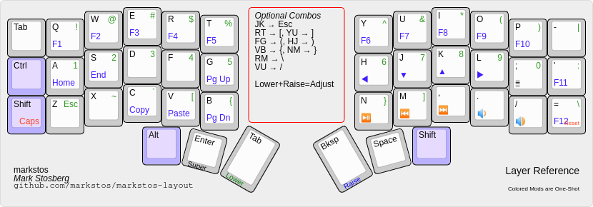
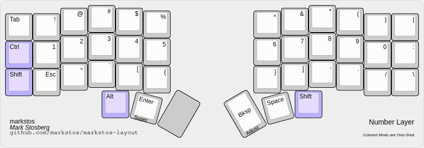
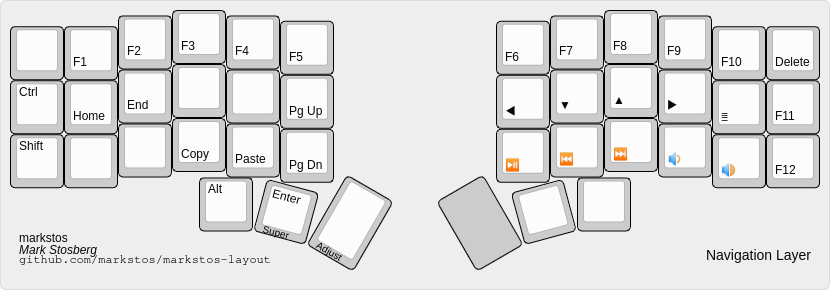

# Markstos Corne keyboard layout

The perfect keyboard is invisible. The typing is accurate. It doesn't distract me. I'm in the flow state. I type as fast as I think. 

The Corne keyboard has only 42 keys. There's a simple ergonomic principle behind the design: every key is at most one away from the home row. All can reached by feel with confidence. 

This the layout I use on my Corne. With all keys easy to reach and ergonomic, it has improved my flow increased my typing speed from 65 WPM to 85 WPM.

## Layout design goals

 * Be similar enough to conventional laptop keyboards so that switching back and forth is not too painful.
 * Most keys should be triggered by one or two key presses.
 * Minimize awkward hold-and-tap sequences by using one-shot modifiers.
 * Shift work from weak pinkies to strong thumbs
 * Thumbs should rest on commonly type keys
 * Vim-friendly features
 * Include media keys
 * Friendly for tiling window managers

## Non-goals

 * There is room for RGB lighting controls on the adjust layer, but I don't use lighting and these were removed to simplify things. Lights were novel but distracting. The two halves would get stuck out of sync. The keyboard is so small, with every key easy to reach, so there's little reason to look at it, even in the dark.
 * OLED display support has been disabled to save space in the firmware. Another distraction removed.
 * Likewise, there are no mouse-key bindings. I tried these and there are slower than just switching to the mouse and back. A dedicated pointing device is the right the tool for the job.

# Summary of layout

Most functionality on three layers: QWERTY, Number/Symbols, and Navigation. A fourth later containing just Caps Lock and Reset is rarely used.

Let's look at the layers one by one.

## QWERTY Base Layer

There no surprises with the alphabet keys, but there some interesting choices for the pinky and thumb keys.

Common keys have been moved from pinky positions to thumb keys: Enter and Space are very common and get prime positions on the centered thumb key.
Backspace and Shift keys have also been moved from pinky positions compared to a traditional keyboard.

For the Tab key, there's a choice between a traditional pinky position or a thumb key.

The base layer contains some of my most common symbol keys I use the, the equals key and the dash/minus key-- common for CLI commands.

### Benefits of a thumb shift key

Thumb shift key shines when typing an all caps word. With pinkie-shift,
normally you switch and forth between the left and right shift key depending on which character is being type, and typing an ALLCAPS word would mean double the number of keystrokes as Shift is typed for each character.

To type an ALLCAPS key with this layout, just hold down the thumb-shift key, type the whole word and release-- the thumb shift works when typing with either hand.

While it may look weird to have asymmetric shift keys, they are more like primary and secondary. I use the thumb shift key nearly all the time as a one-shot modifier. The left shift key is useful in combination with the navigation layer.

### Key chord combos

Several more keys are accessible on the base layer through combos-- pressing two keys at once. These are optional and available on the number layer as well.

The combo I use the most is "JK" to emit "Escape". Inside Vim, something similar can be configured with `inoremap jk <esc>`. However, I frequently use Vim on remote machines where my custom `.vimrc` is not present. I love having this in the keyboard for those occasions.

The goal was to bring some the symbols I use more commonly to the base layer.

For coding there are parens, brackets and braces available on the base layer
through combos. I can fairly reliably press the inner pairs two columns of keys with a single finger by pressing the space in between the two keys. With the shape of MT3 key caps, it's very easy to feel if your fingers are in the "bowl" of a single key or on the ridges between two keys.  Essentially this adds a hidden extra column of keys! In practice, it's often faster to access the keys through the number layer.

None of the combos are required. However, they are fun to use sometimes and are rarely typed by accident so I leave them in the layout.

#### Braces, Parens and Bracket Combos to be pressed with a single finger

These are all symmetric-- the combos for the open and closing elements are mirrored on the left and right halves of the split keyboard:

* RT → [, YU → ]
* FG → (, HJ → )
* VB → {, NM → }

 To remember the order, think of them getting going from flat to curvy from top to bottom.

#### Forward and Backslash Combos: visualizing drawing slashes with your hands

The forward and backslash combos are also mirrored making them easier to remember.

  * RM → \ Visualize a line from the R key to the M keys making a backslash shape.
  * VU → / Visualize a line from the V key to the U keys making a forward slash shape.

## Number and Symbol Layer

Typing a single number here and there is arguably faster with a dedicated
number row.  But numbers often come in clusters, like a date (01/02/2020), a
time (12:04) or a cost: ($1,234.05).  As you get into typing a string of keys
on a dedicated number row, the whole hand moves up the number row and you've
lost the grounding of the home row. Typing "$4" on a traditional keyboard isn't particularly convenient because the "$" and "4" are on the same key.

In this layout, just hold the thumb on the number layer once, type the whole stream of numbers of numbers and symbols with your hands comfortably on the home row the whole time and release.  The colon is repeated on the number row to help type times like "12:34"

Typing "$4" is no problem as the numbers and their shifted symbols are broken out with unique key codes.

The comma, period and slash keys are repeated from the base layer to support typing full dates, times and currency values without switching layers.

I frequently type the tilde when working in a CLI and commonly type the backtick as well when formatting Markdown. On a traditional keyboard those would be long reaches for the weaker pinky, but here they are conveniently located for stronger fingers to use.

### How to type combinations like Control-Alt-4

Alt and the number layer key are both on the same thumb so they can't both be held down at once. The apparent conflict is solved with one-shot modifiers.

To type Control-Alt-4, tap Alt, tap Control, then hold the number layer modifier and type "4".

I tried using home-row mods but I prefer this.

## Navigation layer: More than just arrow keys

In addition to arrow keys, the navigation layer also includes Home, End, Page Up, Page Down and the App key. On my traditional keyboard I avoided using those keys because they were inconvenient to access. But they are supported in nearly every application so the navigation layer gives you home row superpowers to navigate through documents in almost any app.

The "App" key is useful for showing context menus via keyboard that are usually shown with a right click. The most common use may be accessing a context menu with typo correction options.

The "Home" and "End" pair are placed next to each other Home coming before End, while Page Up is place above Page Down.

When you misspell a word and see the red underline appear, the App key is perfect for that case.  Use the home row arrow keys to move the cursor back and press the App key just to the right of the arrow keys. The context menu with spelling options will appear. You can use the arrow keys to
select your option. Done? Use the End key to return to the end of the line.

The whole sequence can be done holding down the thumb key for the Navigation layer and staying on that layer.

If you need to select text during this process, the left Shift can be used for this.

The navigation layer also contains "Copy" and "Paste" keycodes, placed on the "C" and "V" keys usually used for copy/pasting. These are useful in terminal apps where "Control-C" and "Control-V" are reserved by the shell, so "Shift-Control-C" and "Shift-Control-V" are typically used instead. By using the navigation layer, Copy and Paste returns to being a two-key job. Also, as long your favorite apps support these uncommon keycodes, you can use the same copy/paste shortcuts everywhere instead of remembering that the terminal requires an exceptional combination.

## Adjust layer: Not much to see here

The Adjust layer is accessed by holding down both interior thumbs keys. It's minimal because three layers is enough for me and I don't using both thumbs plus a finger to trigger a single key press.

Here Caps Lock is in the Shift key position while Reset is mirrored on the right side.

## What about 3x5 layouts?

I'm a fan of giving my pinkies light work and considered a 3x5 layout to eliminate the outer pinky columns. I consider this is a "3x5.5" layout because
although it contains the outer columns, they are lightly used and there are no "hold" modifiers required by pinkies. The fairly-common "Tab" key and "Shift" keys can be activated with a thumb instead.

This provides most of the ergonomic benefits of a 3x5 layout without the extra layout gymnastics that are required by completely dropping the 6th column.

If you wish to adapt this to a 3x5 layout, not too many changes would be required.

## Compared with the Miryoku layout

I studied the [Miryoku Layout](https://github.com/manna-harbour/miryoku), which is an elegant 3x5 layout. For my tastes, I'm a big fan of one shot modifiers and there is simply not room to use them in a 3x5 layout. While I imagine it's possible to "dial in" the time between a tap and hold so you can type both fast and accurately when using dual-use home row modifiers, with one-shot modifiers there no timing issues. Tap them or hold them as quickly as you like! 

Miryoku, while ergonomic, is a radical departure from traditional keyboard layouts which I continue to need to use on traditional keyboards. This layout maintains more similarities, including the "Control" and "Alt" positions as well putting numbers and symbols in the same columns that appear ona  normal keyboard.

## Any regrets or weaknesses?

* To type "Super-1" requires awkwardly holding down the Super key and number layer key with the left thumb. I don't need this key combination. I only use Super with the Sway tiling window manager and I set all my Sway keybindings to use keys on the base layer. When holding Super, I treat the top row as if they are number keys, so Super-Q goes to workspace 1, Super-W goes to workspace 2, and so on. Since I'm not looking at keyboard, I visualize Super-Q as "Super-1".

* I use the Control+Super prefix a lot with my window manager. It might be nice to have a single key press for that. Perhaps I'll make a home row key dual use so that it emits Control+Super when held.

* I might add "Scroll Up", "Scroll Down" to the navigation layer.

## Visualizations

 * Markstos Layer Reference in [Keyboard Layout Editor](http://www.keyboard-layout-editor.com/) 
   ([PNG](./markstos-layout-full.png))
   ([json](https://gist.githubusercontent.com/markstos/5f29bf8a9d3d197eec96aacc48473ac7/raw/4b9850056cd6cf6b10be9db4bc34965ada9056bc/Corne,--markstos-layout-_All-Layers_.kbd.json))

## Disclaimer

This is my personal layout and is subject to evolve further with my tastes. Fork your own copy if need stability. Suggestions welcome.
